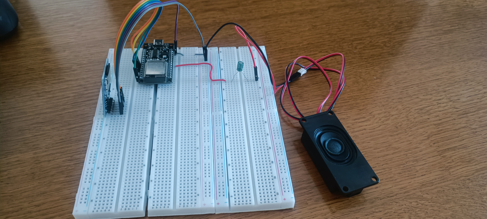

# ESP32 WAV Audio Player (FreeRTOS & DAC DMA)

Un riproduttore audio basato su **ESP32** e framework **ESP-IDF** (C++). Il progetto legge un file WAV da una scheda MicroSD e lo riproduce tramite il DAC interno a 8-bit utilizzando l'accesso diretto alla memoria (DMA) , garantendo un audio fluido e senza interruzioni.

L'architettura software è basata su **FreeRTOS**, con task separati per il controllo hardware (pulsante) e la riproduzione audio, sincronizzati tramite semafori binari.

## Funzionalità
* Lettura di file `.wav` direttamente da MicroSD tramite bus SPI.
* Riproduzione audio asincrona gestita da DMA (Direct Memory Access).
* Utilizzo dell'APLL clock per frequenze di campionamento precise (16000 Hz) senza crash del divisore di clock.
* Architettura Multi-Tasking con FreeRTOS.
* Debounce hardware/software per la lettura sicura del pulsante tramite GPIO.
* Logica orientata agli oggetti (OOP) in C++.

## Requisiti Hardware

* **Scheda:** ESP32 Development Board (testato su Rev 3.1)
* **Storage:** Modulo MicroSD Card (SPI)
* **Audio:** 
  * Speaker/Cassa 
  * Condensatore elettrolitico (es. 10µF) per filtrare la corrente continua (DC blocking)
* **Input:** Un pulsante (Push Button) normalmente aperto

### Cablaggio (Pinout)

| Componente | Pin ESP32 | Note |
| :--- | :--- | :--- |
| **MicroSD MOSI** | `GPIO 23` | SPI Data In |
| **MicroSD MISO** | `GPIO 19` | SPI Data Out |
| **MicroSD CLK** | `GPIO 18` | SPI Clock |
| **MicroSD CS** | `GPIO 5` | SPI Chip Select |
| **Pulsante (Play)** | `GPIO 32` | Collegato tra GPIO 32 e GND (Usa la resistenza di Pull-Up interna) |
| **Audio Out (DAC)** | `GPIO 25` | Collegare al polo positivo del condensatore. Il polo negativo va alla cassa. |
| **Cassa (GND)** | `GND` | Chiusura del circuito audio |

Questo progetto è sviluppato con l'estensione **Espressif IDF** (v6.0 ).
